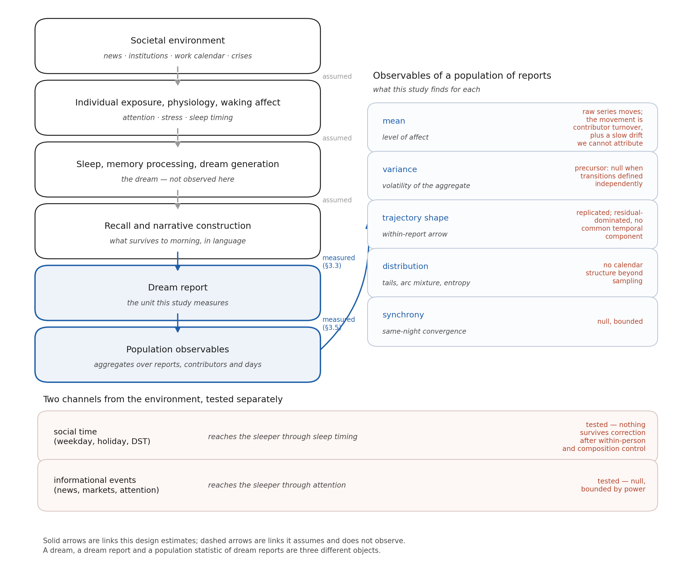
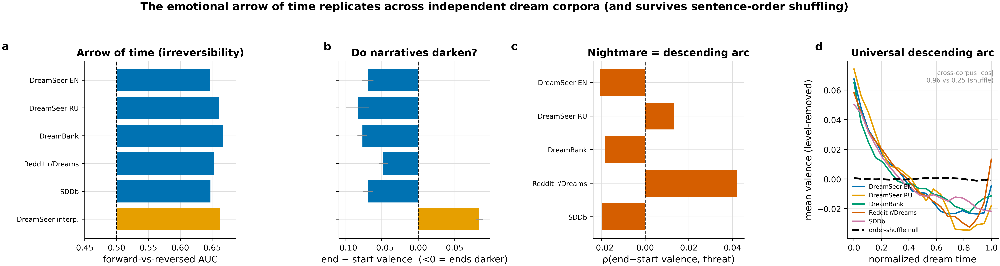
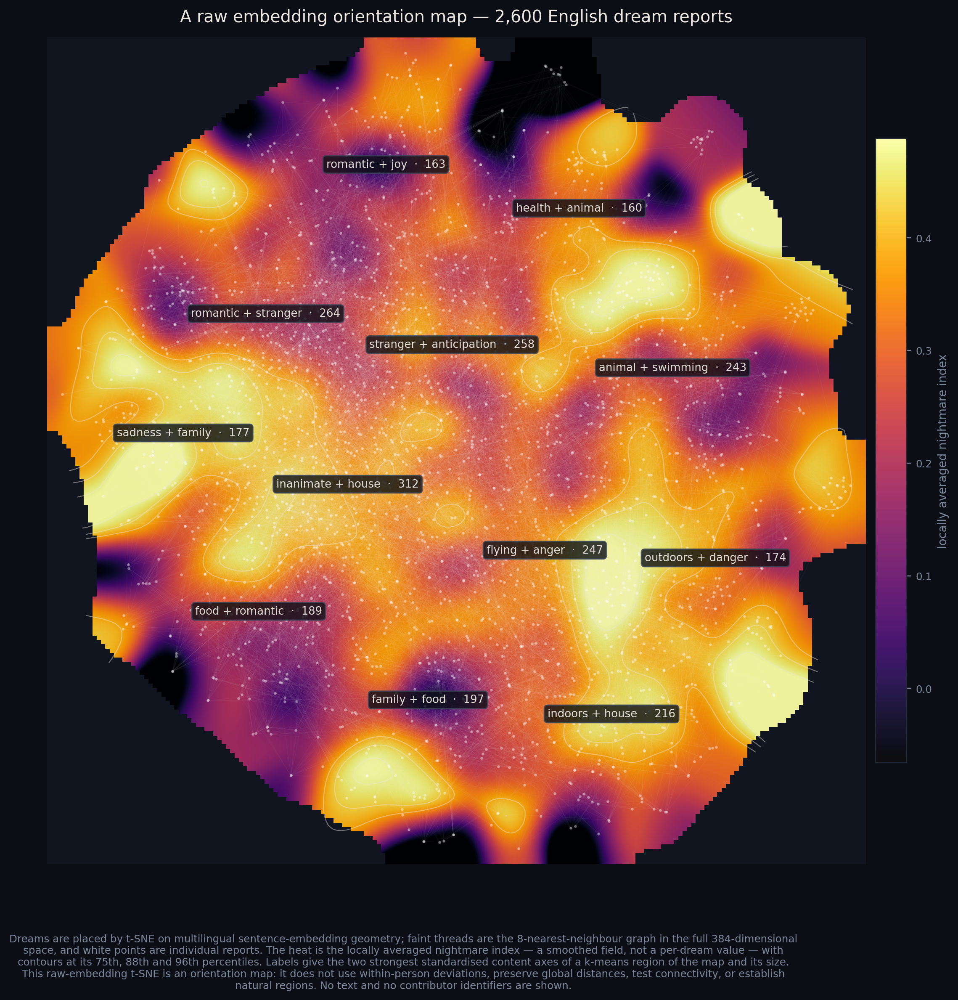
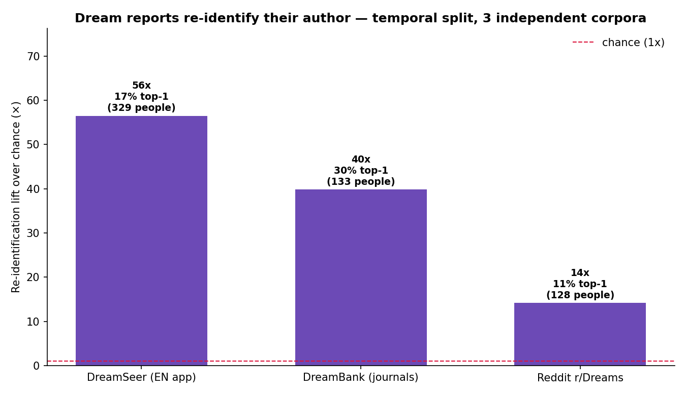

# The shape of a population's night

*A popular account of [Measuring a dreaming population](../academic/dream-dynamics.md). Numbers in the
prose trace to that manuscript, and where the two disagree the manuscript wins. The two arc videos are
the exception: they were built for this article and scored on a smaller sample, so read effect sizes
from the paper, not from a video frame.*

---

## Berlin, 1933

Between 1933 and 1939 the journalist Charlotte Beradt went around Berlin asking people what they had
dreamed. A doctor dreamed the walls of his flat had silently vanished, leaving him visible to the
street. Others dreamed of forms they could not fill in, doors that would not shut, neighbours who
denounced them. Her premise was that a population's dreams might record something its public speech
could not.

For ninety years that was a beautiful and untestable idea — you cannot run a controlled study on a
vanished city. Then people started writing their dreams into apps, every morning, in numbers.

This study pooled more than 75,000 dream reports from four sources and two languages: 30,241 reports
from 5,524 users of the DreamSeer app, plus roughly 45,000 from DreamBank's archive of dream journals,
the r/Dreams subreddit, and the Sleep and Dream Database. One scoring pipeline ran across all of them,
so the corpora can be compared rather than merely stacked.

What that buys is a new kind of dial: a daily, population-scale readout of what a great many people
say they dreamed. This article is about what the dial is sensitive to — which turned out to be
stranger and more layered than the question we started with.

One caveat governs everything below, because it is structural rather than decorative. A dream, a dream
report, and a statistic about a pile of dream reports are three different objects, and we only ever see
the third. What reaches us was composed after waking, from memory, in language, for an audience, by
someone who chose to type it in.

---

## Dreams run downhill

*This is the load-bearing result, and the one that survived the most attacks — everything else in this
article is hedged against it.*

Split a dream report into sentences, score each sentence for emotional tone, and you get a small
trajectory. One at a time these are chaos. Averaged, they are not: the population's dream report begins
near neutral and ends darker than it started.

<video src="../../60-results/videos/arrow-of-time.mp4" controls loop muted width="100%">
  Your viewer does not support embedded video —
  <a href="../../60-results/videos/arrow-of-time.mp4">watch arrow-of-time.mp4</a>.
</video>

*Left: 260 individual reports as unlabelled faint lines, with the running average in bold. Middle: the
same reports with their sentences shuffled. Right: how the average settles as reports accumulate.
Scored on a 3,000-report-per-language sample rather than the paper's estimation sample, so read effect
sizes from the manuscript. ([source](../../analyses/2026-08-24-02-video-arrow.py))*

The middle panel is the entire argument. Same reports, same sentences, same scores — only the *order*
scrambled — and the average goes flat. The descent therefore lives in narrative sequence, not in the
scoring model and not in the fact that dreams are gloomy on average. Shuffling preserves the gloom and
destroys the arrow.

Then the obvious objection: perhaps reports end dark because that is simply where the dream stopped,
something frightening having woken the sleeper mid-fall. So we deleted the endings — six different ways,
from removing the last sentence to keeping only the interior to splitting reports by whether they end
on an awakening at all, plus a seventh arm that throws out the most threat-laden reports entirely.

**Deleting the ending makes the descent deeper.** In all seven corpus-and-instrument combinations. In
this audit the last sentence of a dream report is, on average, a small lift — a relief coda at the
moment of waking, though under the stricter scoring it is clearly positive in only one corpus of the
five. Take it away and the fall gets worse. Across the 53 cells the full audit produces, the descent
stayed negative in 52.

How far down is far? Ordinary prose drifts downward too — we ran first-person accounts of real events,
literary fiction and encyclopedia openings through the identical pipeline, and all of them drift. So
dreams are the extreme case of something writing in general does. Three of the five dream samples fall
roughly two to five times further than every comparator, across all nine contrasts: DreamSeer in
English, DreamSeer in Russian, and DreamBank's archival journals — two of the three being the same app,
which bounds how broadly this travels. Treat the multiplier as a rough size comparison rather than a
measurement: one of these ratios carries an interval running from 2.3 to 8.5. It is about *where a
report ends* relative to where it began, and on the measure that uses every sentence instead of the two
ends, those three separate in six of the nine contrasts. The other two dream samples, Reddit and the
Sleep and Dream Database, do not separate from the waking comparator on any measure of descent at all.

The difference from waking writing also turns out to sit at the *beginning* rather than the end. Dream
reports start nearer neutral and then fall; first-person accounts of real events start already dark, at
their subject, and stay there. It is a difference of depth and of starting point, not of how things
finish.

Which raises the obvious objection — dream reports start higher, so of course they have further to fall
— and it is already answered. The comparison is expressed in units of how much each corpus's own
sentences ordinarily move, so a corpus does not earn a bigger number by being more volatile or by
starting anywhere in particular. Standardizing that way *widens* the central contrast rather than
rescuing it: DreamSeer English against waking narrative goes from 4.4 to 5.2.

---

## A regularity that no single dream contains

This is the part that is properly about populations, and it is my favourite result in the project.

No individual dream has the arc. Average twenty reports and you still get a jagged mess that looks
nothing like the smooth curve. The shape is not sitting in the data waiting to be found — it
*condenses out* of it.

<video src="../../60-results/videos/regularity-emerging.mp4" controls loop muted width="100%">
  Your viewer does not support embedded video —
  <a href="../../60-results/videos/regularity-emerging.mp4">watch regularity-emerging.mp4</a>.
</video>

*Left: the running average over one group of contributors, converging on the finished average of a
completely separate group (dashed). Middle: the same, with sentence order shuffled. Right: the distance
between the two groups shrinking, against the dashed line that averaging *independent* noise would
give. This is a demonstration built for this article rather than a result from the paper — it
illustrates a point the manuscript makes in prose, on the same 3,000-report-per-language sample.
([source](../../analyses/2026-08-24-04-video-emergence.py))*

The right-hand panel is the necessary pedantry. Comparing a running average to its own final value
guarantees convergence and demonstrates nothing, so the *people* were split in two — 487 contributors
on each side, nobody on both — and one group has to predict the other group's finished arc. It does.

That is a strong statement about a population. The smooth curve is not an artefact of adding up the
same reports, and not a classifier slowly memorising a few prolific dreamers. It is a stable property
of the population, reconstructible from strangers.

And the direction is not only an aggregate: between 56% and 88% of contributors, depending
on the corpus, darken on their own average. The smooth curve is a population object; the
downward tilt belongs to people.

It converges slightly slower than independent averaging would predict, which is itself a population
fact rather than a blemish — those 3,000 reports come from 974 people, so each new report is partly a
repeat of someone already counted, and repeat draws buy less than fresh ones.

---

## One continent

Embed every report as a point in semantic space, draw a link whenever two reports are similar enough,
and ask what you get: an archipelago of unrelated stories, or something connected?

<video src="../../60-results/videos/semantic-continent.mp4" controls loop muted width="100%">
  Your viewer does not support embedded video —
  <a href="../../60-results/videos/semantic-continent.mp4">watch semantic-continent.mp4</a>.
</video>

*Left: 420 dream reports, linked when more similar than the current threshold — a small sample drawn
for legibility, which comes apart at a lower threshold than the full measurement does. Middle: the same
numbers with each semantic dimension shuffled independently across reports, preserving every
dimension's distribution and destroying only what makes two reports alike. Right: the actual
measurement, on 5,000 English DreamSeer reports across three subsamples.
([source](../../analyses/2026-08-24-03-video-percolation.py))*

At a similarity threshold of 0.50, **95% of reports belong to a single connected mass. The shuffled
null is at 0%.** Push the threshold higher and the real corpus keeps its continent long after the null
has crumbled into dust.

That is a population's language holding together, and it is narrative language rather than dreaming's
private property: matched waking accounts and fiction produce the same continent, interleaving with
dreams between 89% and 96% connectivity. The only corpus that comes apart is the non-narrative one —
encyclopedia openings hold 67% where dreams hold 95%, and collapse to 15% a little higher up, by a
margin nobody needs a significance test to see, which is just as well, because no formal test of that
gap was run. Which is the more interesting version of the result, and the second thing here I would
defend anywhere: dream reports are fully paid-up members of narrative language, and this geometry tells
narrative from non-narrative. (One boundary: the encoder saw only the first 256 characters of each
report, so this is a map of dream *openings*.)

*A map, not a test. The projection preserves neither distances nor areas and the shading is a smoothed
annotation — it is here to orient, and carries no evidence about the section above.*

<video src="../../60-results/network-gallery/figures/network-breathing.mp4" controls loop muted width="100%">
  <a href="../../60-results/network-gallery/figures/network-breathing.mp4">watch network-breathing.mp4</a>
</video>

*The feature network over calendar time. Report volume and contributor turnover are plotted alongside,
because platform growth remains a rival explanation for anything that appears to breathe.*

---

## Your reports are written in your handwriting

Train a classifier on someone's earlier dreams, test it on their later ones, and it identifies them far
above chance: **56 times better** in the app data, 40 times in DreamBank's journals, 14 times among
Reddit posters. Three corpora, two of them independent of the app. (This one is established context
from a companion analysis rather than a result of this study — it is here because it locates everything
else.)

"Better than chance" is doing real work in that sentence. The candidate pools were a few hundred people
per corpus — 329, 133 and 128 — so chance runs from about one in a hundred and thirty to one in three
hundred, and the absolute top-choice rate is 17% in the app data. Impressive, not clairvoyant. And what gets identified is the signature of
a written *report*: the words someone reaches for, content and style together, not a readout of anyone's
unconscious.

It is stable over time and survives a near-duplicate guard. Which means a corpus of "anonymous" dream
reports is not anonymous in the way people assume. That is a privacy result before it is a psychology
result, and it is why no raw dream text from this project has ever left the machine it was analysed on.

---

## Only the machine consoles you

The app also generates an automated interpretation of every dream. Those interpretations lift **+0.26
in their final sentence alone** — more than three times the largest closing step anywhere else in the
design, dreamt, lived, invented or encyclopedic. Delete that last sentence and they stop rising
altogether. The consolation is *appended*, not reasoned toward.

Most human corpora do close with a small positive step, so comfort is not the machine's invention.
What belongs to the machine alone is comfort large enough to reverse the direction of the entire
account. It is a measurable property of one production system working from one prompt template — and
worth measuring, now that a great many people receive their emotional readings from something like it.

---

## What gets into the dial

So: what from the outside world actually shows up in a population's dream stream?

**A pandemic gets in — as vocabulary.** *(A check that the instrument works, not a finding.)*
DreamSeer's window opens in March 2024, so COVID is out of its reach entirely; this test runs on an
archive of 17,994 r/Dreams reports spanning 2019 and 2020. Explicit pandemic vocabulary rose
**ninefold**, from 0.4% to 3.7% of reports, a fitted jump of 4.68 percentage points — larger than all
44 placebo cutoffs tested at other dates. So the instrument does resolve the event. But a rise in the
words *covid* and *lockdown* after March 2020 is close to semantically guaranteed whether people were
dreaming about the pandemic or merely describing their dreams in the language everyone had started
using, which is why the paper reads it as a passed manipulation check rather than a discovery.

The latent themes are the interesting part, and they did not move detectably: not contagion, illness,
contamination, death or masks, with every placebo p ≥ .37. That non-detection has a reach, though —
the test could only have caught movements of roughly two to eight percentage points depending on how
common a theme already was, so it bites for the rarest themes and is underpowered for the commonest.
And two neutral control themes with no lockdown story at all, *vehicle* and *animal*, shifted about
2.5 points, which establishes that drift in who was posting displaces these rates by about that much
on its own. The shock entered the words. Whether it entered the dreams is not something this
measurement can settle.

**The institutional week gets in.** *(A single uncorrected contrast.)* Friday reports are slightly
lighter than Monday reports in English — a small effect (p = .008). It does not replicate in Russian,
and it splits almost exactly in
half between a change in *who* reports on Fridays and a change within the same people — of which only
the compositional half is individually resolvable, while the within-person half cannot be separated
from zero at this sample size. The channel is plausible: the weekday-to-weekend sleep shift averages
more than half an hour, and sleep timing is a real route by which the calendar reaches the sleeper.
But this is a probe, not a result.

---

## The stream also has its own weather

One population-scale pattern is not about the outside world at all, and it is the most tantalising
thing in the project.

Ahead of the sharpest **darkenings** of the corpus's own nightmare content — the days when that content
rises fastest — the *variance* of it rises first. Not the average, the spread (Kendall's τ = +0.236).
Rising variance before a transition is one of a family of early-warning signatures studied in ecology
and psychiatry.

This is frontier rather than finding, and worth being blunt about. There are only **twelve** such
episodes. The signal they sit on is mostly noise: between four-fifths and nine-tenths of the daily
nightmare series' movement is sampling error, depending on whether you score the raw series or the
detrended one the precursor is actually computed on. The companion signature that would
license the phrase "critical slowing down" — rising autocorrelation alongside rising variance — is
**absent**, and we looked for it. It clears four of the five surrogate constructions we built rather
than five. The episodes are excursions of this series against itself, not entries from a news list, so
nothing here says the population anticipates events. And the broader literature is not on our side: the
appraisal we cite finds little support for these early-warning signals as generic predictors in
clinical psychology at all. It is frozen for re-testing at thirty episodes and a second densely dated
corpus.

**The week-to-week weather of public mood does not get in.** This is a specification of the instrument
rather than a shrug. Thirteen dream axes were run against nine societal indicators — news tone, news
volume, war and worry searches, Wikipedia crisis and hope attention, a news-sentiment index, a
prediction market where people bet on how bad things will get, and the horror share of film releases —
117 combinations in all, on the English-language weekly series. Nothing survived correction for
multiple testing, under four different estimators and two kinds of surrogate null. A separate battery
covering markets and macroeconomics came back the same way.

The bound matters more than the null, and it is uneven in a way that runs against us. With two years of
weekly data the dial could see a correlation of about 0.30. Correcting for how noisily each axis is
measured week to week, a true association of 0.38 on the best-measured axes — **0.55 to 0.69 on the two
negativity axes anyone would ask about first** — would still have been invisible. And on the
worst-measured axis, negative sentiment, the correction has *no upper bound* at this number of weeks:
there, the null bounds nothing at all. The paper calls that asymmetry the single most important
qualification on this null, because the axes it constrains tightly are not the axes anyone cares about.

So what is ruled out is coupling large enough for *this* design to see, in *these* series, at weekly
resolution. Anything smaller or slower is untested rather than refuted, and coupling in the Russian
cohort is untested outright — those indicators are all English-language and US-centred, so the Russian
reports were tested against somebody else's news. Nor was every cell empty: weeks of high crisis
attention did recur as weeks of darker, more dispersed reports, in several places and without surviving
correction. That is where a sharper instrument should point next.

---

## Different floors

A population of dream reports is organised at several levels at once, and the levels do not move
together.

Inside a single report there is a robust, order-dependent emotional descent — present in every corpus
and both languages under the screening instrument, in four of the five under the stricter one, and
getting *deeper* rather than weaker when you attack it. Across the reports of one person there is a
signature strong enough to re-identify them. Across the whole population there is a single connected
continent of narrative language, a weekly rhythm whose resolvable half is composition, a restlessness
that may or may not be an early warning, and a vocabulary that jumped ninefold when a pandemic arrived.

Beradt wanted to know whether the building had a ground floor open to the street. On this evidence the
opening is narrower than she hoped — wide enough for events large enough to become words, closed to the
week-to-week weather of public mood — and the architecture worth exploring is upstairs, inside the
individual night, where nobody was looking for it.

---

## Reproducing this

Everything above is generated by scripts in the repository, and the manuscript indexes each number to
the analysis that produced it (Supplementary Reproducibility table, scripts 001–026). The three videos
are built by [`2026-08-24-02-video-arrow.py`](../../analyses/2026-08-24-02-video-arrow.py),
[`2026-08-24-03-video-percolation.py`](../../analyses/2026-08-24-03-video-percolation.py) and
[`2026-08-24-04-video-emergence.py`](../../analyses/2026-08-24-04-video-emergence.py); each writes a
short `.md` beside its output recording the numbers on screen and the sample they came from. The
percolation script recomputes the published curve and refuses to render if it disagrees. All three sit
*outside* the manuscript's numbered reproducibility index: the percolation video reproduces a figure in
it, and the two arc videos are illustrations built for this article.

Raw dream text and user identifiers are never published — see
[`docs/ETHICS.md`](../../docs/ETHICS.md). What is shareable is code plus de-identified aggregates: every
released cell that carries its own denominator is checked against a floor of 20 reports and 5
contributors by a script that refuses to build the public release if it fails.

Individual reports do appear here, in three places, and never as text: the faint unlabelled lines in
the first video, the 420 nodes in the percolation video, and the points of the galaxy map. None carries
a word of narrative, a date or an identifier — they are drawn to give the aggregates something to be
aggregates *of*. It is also why the running averages in both arc videos start at twenty reports rather
than at one. For the original corpora, go to their sources — DreamBank, the Sleep and Dream Database,
and Reddit's own archives.
